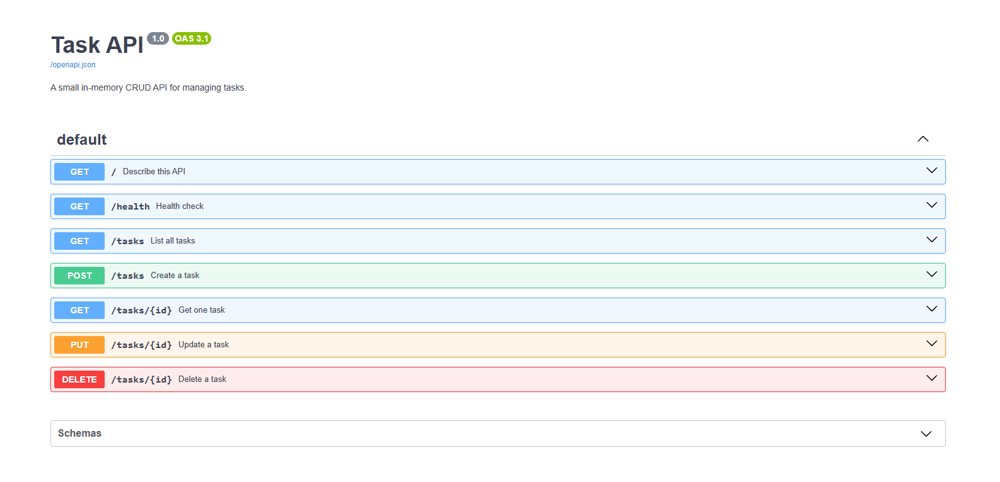

# Task API

A small CRUD API for managing a to-do list, built with **FastAPI**.

Tasks are stored **in memory only** — there is no database, so all data resets to the three seed tasks every time the server restarts.

A task looks like this:

```json
{ "id": 1, "title": "internship", "done": false }
```

## Requirements

- Python 3.10 or newer

## Setup (once)

```bash
pip install -r requirements.txt
```

## Run

```bash
uvicorn main:app --reload
```

The API is now at `http://localhost:8000`, and interactive documentation is at `http://localhost:8000/docs`.

## Endpoints

| Method | Path | Description | Success | Errors |
|---|---|---|---|---|
| `GET` | `/` | Describe the API | `200` | — |
| `GET` | `/health` | Health check | `200` | — |
| `GET` | `/tasks` | List all tasks | `200` | — |
| `GET` | `/tasks/{id}` | Get a single task | `200` | `404` unknown id |
| `POST` | `/tasks` | Create a task | `201` | `400` missing or empty title |
| `PUT` | `/tasks/{id}` | Update title and/or done | `200` | `400` empty body · `404` unknown id |
| `DELETE` | `/tasks/{id}` | Delete a task | `204` | `404` unknown id |

## Example request

Creating a task returns `201 Created` along with the stored object:

```
$ curl -i -X POST http://localhost:8000/tasks \
    -H "Content-Type: application/json" \
    -d '{"title":"Buy milk"}'

HTTP/1.1 201 Created
date: Mon, 10 Aug 2026 15:04:14 GMT
server: uvicorn
content-length: 40
content-type: application/json

{"id":4,"title":"Buy milk","done":false}
```

## Swagger UI

FastAPI generates interactive documentation from the code itself, available at `http://localhost:8000/docs`. Every endpoint can be run straight from the browser with **Try it out** — no curl needed. The raw OpenAPI description it is built from is served at `/openapi.json`.



## Project structure

```
.
├── main.py            # the entire API
├── requirements.txt   # fastapi + uvicorn
├── README.md
└── docs/
    └── swagger.png
```

## Notes

Data lives in a Python list, so it disappears when the process stops. Persisting it to a real database is the next step.
