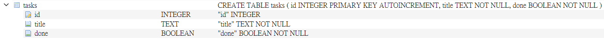

# Task API

A small CRUD API for managing a to-do list, built with **FastAPI** and **SQLite**.

Tasks are stored in a SQLite database file on disk, so data persists across server restarts.

A task looks like this:

```json
{ "id": 1, "title": "internship", "done": false }
```

## Why SQLite?

SQLite was chosen for this project because:

- **No extra setup** — Python includes `sqlite3` in the standard library, so there is no database server to install or configure.
- **File-based storage** — the entire database is a single file (`tasks.db`), which makes it easy to inspect, back up, and reset during development.
- **Good fit for learning** — SQL queries can be run directly against the file using DB Browser for SQLite or the terminal, and changes are immediately visible through the API.
- **Right-sized for a small API** — for a single-process app with moderate traffic, SQLite is simple, fast, and reliable.

## Database location

The database file is stored at the project root:

```
tasks.db
```

This file is **created automatically** the first time you start the server. It is listed in `.gitignore`, so it is not committed to git — each clone gets a fresh database when the app runs.

The schema and seed data are defined in `db.py`. On startup, `main.py` calls `init_db()`, which:

1. Creates the `tasks` table if it does not exist
2. Inserts three sample tasks if the table is empty

## Requirements

- Python 3.10 or newer

## Setup (once)

```bash
pip install -r requirements.txt
```

## Run

```bash
uvicorn main:app --reload
```

The API is now at `http://localhost:8000`, and interactive documentation is at `http://localhost:8000/docs`.

On first run you should see:

```
Database initialized with sample tasks.
```

Verify the database was created:

```bash
curl http://localhost:8000/tasks
```

## Endpoints

| Method | Path | Description | Success | Errors |
|---|---|---|---|---|
| `GET` | `/` | Describe the API | `200` | — |
| `GET` | `/health` | Health check | `200` | — |
| `GET` | `/tasks` | List all tasks | `200` | — |
| `GET` | `/tasks/{id}` | Get a single task | `200` | `404` unknown id |
| `POST` | `/tasks` | Create a task | `201` | `400` missing or empty title |
| `PUT` | `/tasks/{id}` | Update title and/or done | `200` | `400` empty body · `404` unknown id |
| `DELETE` | `/tasks/{id}` | Delete a task | `204` | `404` unknown id |

## Example request

Creating a task returns `201 Created` along with the stored object:

```bash
curl -i -X POST http://localhost:8000/tasks \
  -H "Content-Type: application/json" \
  -d '{"title":"Buy milk"}'
```

```json
{"id":4,"title":"Buy milk","done":false}
```

On Windows PowerShell, use `curl.exe --%` so JSON quotes are not stripped:

```powershell
curl.exe --% -i -X POST http://localhost:8000/tasks -H "Content-Type: application/json" -d "{\"title\":\"Buy milk\"}"
```

## Example SQL query

During Stage 4, tasks were queried directly against `tasks.db`. One example:

```sql
SELECT * FROM tasks WHERE done = 1;
```

This returns every completed task. You can run it in [DB Browser for SQLite](https://sqlitebrowser.org/) or from the terminal:

```bash
python -c "import sqlite3; conn=sqlite3.connect('tasks.db'); print(conn.execute('SELECT * FROM tasks WHERE done = 1').fetchall()); conn.close()"
```

Changes made in a SQLite viewer are reflected immediately by `GET /tasks` — no server restart needed.

## Database viewer screenshot

DB Browser for SQLite was used to inspect and modify `tasks.db`:



## Swagger UI

FastAPI generates interactive documentation from the code itself, available at `http://localhost:8000/docs`. Every endpoint can be run straight from the browser with **Try it out** — no curl needed.

## Project structure

```
.
├── main.py            # FastAPI app and endpoints
├── db.py              # database connection and initialization
├── requirements.txt   # fastapi + uvicorn
├── README.md
├── tasks.db           # created automatically on first run (gitignored)
└── docs/
    └── db-browser.png # screenshot of the database viewer
```

## Clone and run

Anyone cloning this repository can get the project running with:

```bash
git clone <your-repo-url>
cd flyrank
pip install -r requirements.txt
uvicorn main:app --reload
```

The database file is created and seeded automatically — no manual SQL setup required.
